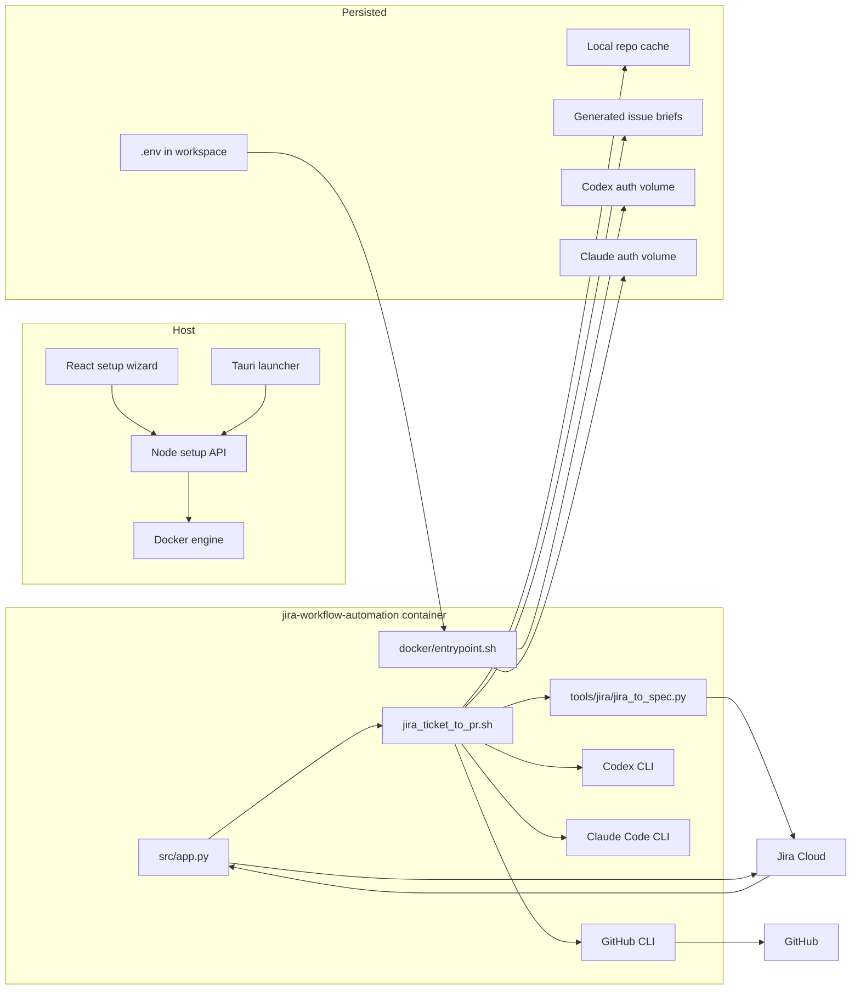
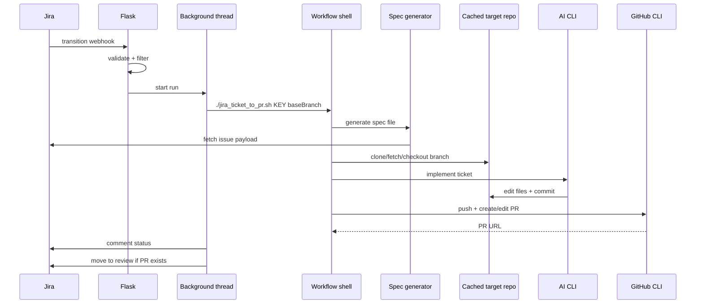

# PRonto Architecture

## System Intent

PRonto is a local-first workflow orchestrator for turning Jira work-item transitions into code changes and GitHub pull requests. Its architecture is deliberately pragmatic:

- Use Jira as the trigger and source of requirements.
- Use generated Markdown as the handoff contract to the AI tool.
- Use existing CLIs for git, PRs, auth, and tunneling instead of rebuilding those capabilities.
- Use Docker as the runtime envelope so the automation environment is reproducible.
- Use a setup control plane to make local installation and diagnosis manageable.

The result is a system with clear seams but a lot of orchestration logic pushed into scripts and subprocesses rather than long-lived services.

## Runtime Topology

## Major Components

### 1. Flask Automation Service

File: [`src/app.py`](/Users/ryankenny/Projects/JiraWorkflowAutomation/src/app.py:1)

Responsibilities:

- Load core environment variables and fail fast if Jira credentials are missing.
- Receive Jira transition webhooks.
- Reject invalid secrets.
- Skip irrelevant transitions.
- Start asynchronous automation work in a background thread.
- Post final status back to Jira through comments and issue transitions.
- Convert noisy subprocess output into filtered log lines that are suitable for operators.

Notable design choices:

- The webhook app is intentionally thin; most business logic is delegated.
- Background work is thread-based, not queue-based.
- Environment is loaded at import time, which keeps runtime simple but makes configuration errors fail early.

### 2. Workflow Shell Script

File: [`jira_ticket_to_pr.sh`](/Users/ryankenny/Projects/JiraWorkflowAutomation/jira_ticket_to_pr.sh:1)

Responsibilities:

- Generate the issue brief.
- Resolve the target repository.
- Clone or refresh the target repository cache.
- Create the working branch.
- Invoke the selected AI CLI with an issue-specific prompt.
- Push the branch and create or update the PR.

Why it matters:

- This file is the real center of automation behavior.
- It couples the issue brief, AI tool, git workflow, and GitHub PR lifecycle into one procedural flow.
- Because it is shell-based, it is easy to inspect and modify, but harder to validate comprehensively than a typed service layer.

### 3. Jira Brief Generator

File: [`tools/jira/jira_to_spec.py`](/Users/ryankenny/Projects/JiraWorkflowAutomation/tools/jira/jira_to_spec.py:1)

Responsibilities:

- Read Jira issue JSON.
- Flatten Atlassian Document Format.
- Extract acceptance criteria heuristically.
- Infer the target GitHub repository.
- Emit a stable Markdown brief.

Architectural role:

- It creates the single artifact that bridges Jira intent and AI execution.
- It is the best place to improve prompt quality without changing the orchestration shell.

### 4. Setup Control Plane

Files:

- [`setup-api/src/server.js`](/Users/ryankenny/Projects/JiraWorkflowAutomation/setup-api/src/server.js:1)
- [`setup-api/src/services/docker-service.js`](/Users/ryankenny/Projects/JiraWorkflowAutomation/setup-api/src/services/docker-service.js:1)
- [`setup-api/src/services/status-service.js`](/Users/ryankenny/Projects/JiraWorkflowAutomation/setup-api/src/services/status-service.js:1)
- [`setup-api/src/services/env-file.js`](/Users/ryankenny/Projects/JiraWorkflowAutomation/setup-api/src/services/env-file.js:1)

Responsibilities:

- Read and write `.env`.
- Validate supported configuration.
- Diagnose Docker and Colima issues.
- Build and run the container.
- Poll container health and logs.
- Validate external integrations independently from the main runtime.

Architectural role:

- This is effectively a local operator API.
- It has no persistence beyond the workspace and Docker state.
- It is intentionally coarse-grained and task-oriented rather than resource-oriented.

### 5. Setup Wizard Frontend

File: [`frontend/src/features/setup-wizard/SetupWizardApp.tsx`](/Users/ryankenny/Projects/JiraWorkflowAutomation/frontend/src/features/setup-wizard/SetupWizardApp.tsx:1)

Responsibilities:

- Guide the user through setup in steps.
- Drive readiness checks.
- Persist config through the setup API.
- Launch the container and render logs and health.

Architectural role:

- The frontend is a thin operator console over `setup-api`.
- It does not contain business logic about Jira automation itself.

### 6. Desktop Launcher

File: [`launcher/src-tauri/src/main.rs`](/Users/ryankenny/Projects/JiraWorkflowAutomation/launcher/src-tauri/src/main.rs:1)

Responsibilities:

- Locate the PRonto workspace.
- Confirm that Node and the built frontend exist.
- Start `setup-api` on port `3010`.
- Open the browser to the local setup flow.

Architectural role:

- This is a packaging convenience layer, not part of the automation runtime.

## End-to-End Control Flow

## Configuration Model

The system uses a layered configuration model:

- `.env.example` provides a broad template.
- `setup-api/src/config.js` defines the supported fields, UI defaults, validation rules, and serialization behavior.
- `docker/entrypoint.sh` normalizes aliases and bootstraps runtime auth.
- `src/app.py` reads a narrower subset required for webhook orchestration.

Important consequence:

- The setup API’s config model is the most accurate description of the supported local setup flow.
- Some older examples still reflect legacy defaults such as `CODEX_EXEC_ARGS=--full-auto`, while the current setup UI prefers Docker-safe flags.

## State Boundaries

There is no database. State is spread across:

- `.env`
- generated briefs in `.codex/`
- repo clones in `.codex/repos/`
- Docker-managed container state
- persisted AI auth volumes
- container logs

That makes the system easy to reset, but it also means:

- there is no audit-grade run history
- there is no structured retry state
- concurrency and recovery are largely implicit

## Process Boundaries

The system depends on subprocesses heavily.

Host-side:

- `node` for `setup-api`
- `docker`
- `colima` when applicable
- `open` on macOS for Docker Desktop support and launcher browser opening

Container-side:

- `gunicorn`
- `python3`
- `git`
- `gh`
- `codex`
- `claude`
- `ngrok`

This is powerful but important architecturally:

- PRonto is not just a Python app.
- It is an orchestration system over a toolchain.
- Most operational failures happen at process boundaries.

## Failure Modes And Recovery

### Webhook-Level

- Invalid secret -> immediate `401`
- Wrong transition -> immediate `200` with `skipped`
- Missing issue key -> immediate `400`

### Workflow-Level

- Missing target repo in Jira brief -> workflow exits
- `gh` unauthenticated -> workflow exits
- AI CLI sandbox incompatibility in Docker -> explicit guidance is returned
- Timeout -> subprocess is killed and tail output is reported
- PR already exists -> script edits existing PR and reuses it

### Setup-Level

- Docker not installed
- Docker context misconfigured
- Colima stopped or broken
- Docker network unable to reach apk/pypi/npm
- Missing frontend build for launcher
- Missing ngrok token or API key for reserved-domain flow

The setup-api code is where most failure diagnosis quality lives.

## Testing Surface

What is well covered:

- Flask route and orchestration logic
- Jira brief parsing
- config normalization and validation
- `.env` read/write behavior
- setup-api routing
- Docker command construction and diagnostics
- readiness-check behavior for third-party APIs

What is weakly covered:

- true end-to-end workflow execution
- shell script behavior under real repo mutations
- launcher behavior
- frontend rendering and interaction

## Architectural Tradeoffs

### Strengths

- Easy to inspect and modify.
- Strong alignment with how engineers already work: Jira, git, GitHub, Docker, CLI tools.
- Good local diagnostics for setup and runtime health.
- Clear artifact boundary via generated issue briefs.

### Weaknesses

- A lot of critical behavior lives in shell and subprocess orchestration.
- Runtime jobs are not durable.
- There is no structured domain model for runs, repos, or outcomes.
- Configuration and documentation can drift because multiple layers define defaults.

## Recommended Evolution Path

1. Introduce a durable run record with states like `queued`, `running`, `pr_created`, `comment_posted`, `failed`.
2. Move execution from in-process threads to a worker model.
3. Encapsulate the shell workflow in a typed service or task runner while keeping the same observable steps.
4. Add end-to-end smoke coverage against a test repo and test Jira project.
5. Treat the generated Jira brief as a versioned contract and test it separately.

## Reading Order For Engineers

If you are onboarding to the codebase, read in this order:

1. [`src/app.py`](/Users/ryankenny/Projects/JiraWorkflowAutomation/src/app.py:1)
2. [`jira_ticket_to_pr.sh`](/Users/ryankenny/Projects/JiraWorkflowAutomation/jira_ticket_to_pr.sh:1)
3. [`tools/jira/jira_to_spec.py`](/Users/ryankenny/Projects/JiraWorkflowAutomation/tools/jira/jira_to_spec.py:1)
4. [`setup-api/src/services/docker-service.js`](/Users/ryankenny/Projects/JiraWorkflowAutomation/setup-api/src/services/docker-service.js:1)
5. [`setup-api/src/services/status-service.js`](/Users/ryankenny/Projects/JiraWorkflowAutomation/setup-api/src/services/status-service.js:1)
6. [`frontend/src/features/setup-wizard/SetupWizardApp.tsx`](/Users/ryankenny/Projects/JiraWorkflowAutomation/frontend/src/features/setup-wizard/SetupWizardApp.tsx:1)

That sequence follows the actual path from trigger to automation to local operator experience.
