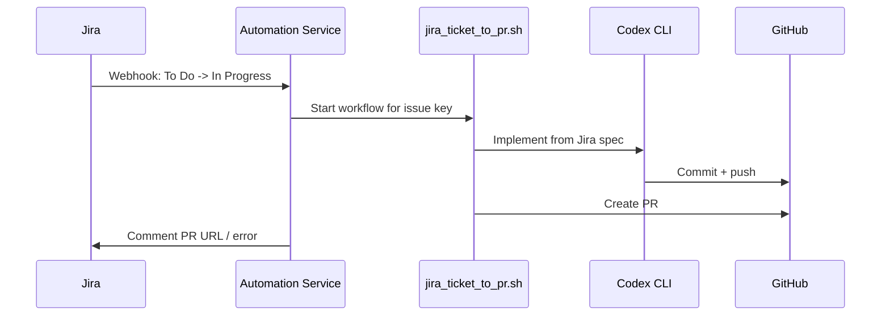
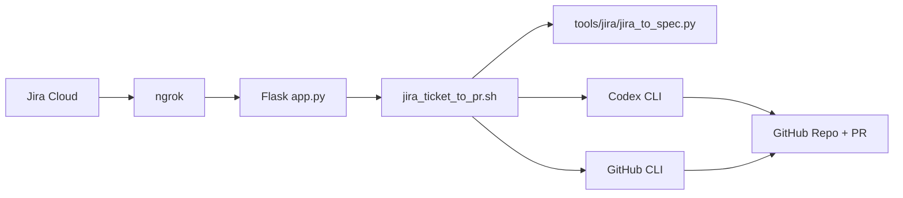

# Jira Workflow Automation

Webhook service (Dockerized) that listens for Jira status transitions and runs a Codex CLI workflow to:

1. Pull Jira issue details.
2. Generate an implementation spec.
3. Clone/select the target GitHub repo from the ticket.
4. Ask Codex to implement and commit changes.
5. Push branch + create PR.
6. Comment result back on the Jira issue.

## Visualizations

- Full diagrams: [docs/architecture.md](docs/architecture.md)

### Workflow Diagram



### Architecture Diagram



## Prerequisites

- Docker
- Jira Cloud project + API token
- GitHub repo access + Personal Access Token (PAT)
- ngrok account (recommended for local webhook exposure)
- OpenAI/Codex access:
  - `CODEX_API_KEY`/`OPENAI_API_KEY`, or
  - interactive `codex login` persisted in Docker volume

## 1) Configure environment

```bash
cp .env.example .env
```

Set these required values in `.env`:

- `JIRA_BASE_URL=https://<your-site>.atlassian.net`
- `JIRA_USER_EMAIL=<jira-email>`
- `JIRA_API_TOKEN=<jira-api-token>`
- `READY_STATUS="To Do"`
- `IN_PROGRESS_STATUS="In Progress"`
- `IN_REVIEW_STATUS="In Review"`
- `GITHUB_TOKEN=<github-pat>` (recommended; `GH_TOKEN` also supported)
- `REQUIRE_GITHUB_AUTH=true`
- `CODEX_EXEC_ARGS=--full-auto`

External key setup:

- Jira API token:
  - Create at Atlassian account security: `https://id.atlassian.com/manage-profile/security/api-tokens`
  - Put Jira site URL/email/token into:
    - `JIRA_BASE_URL`
    - `JIRA_USER_EMAIL`
    - `JIRA_API_TOKEN`
- GitHub token (for push + PR):
  - Create PAT at GitHub settings: `https://github.com/settings/tokens`
  - Recommended fine-grained token permissions:
    - Repository `Contents: Read and write`
    - Repository `Pull requests: Read and write`
    - Repository `Metadata: Read`
  - Set in `.env`: `GITHUB_TOKEN=<token>` (or `GH_TOKEN`)
- OpenAI/Codex access:
  - API key mode: set `CODEX_API_KEY` (or `OPENAI_API_KEY`) and `CODEX_BOOTSTRAP_LOGIN=true`
  - Device login mode: keep API key empty and use persisted login (see below)

Codex auth options (pick one):

- API key mode:
  - `CODEX_BOOTSTRAP_LOGIN=true`
  - `CODEX_API_KEY=<openai-api-key>` (or `OPENAI_API_KEY`)
- Persistent interactive login mode:
  - `CODEX_BOOTSTRAP_LOGIN=false`
  - Run one-time: `docker exec -it jira-automation codex login`
  - State persists in `-v codex-state:/data/codex`

Optional but recommended:

- `JIRA_WEBHOOK_SECRET=<shared-secret>` (leave empty unless Jira webhook secret is configured)
- `NGROK_ENABLE=true`
- `NGROK_AUTHTOKEN=<ngrok-authtoken>`
- `NGROK_DOMAIN=<reserved-domain.ngrok-free.dev>`
- `NGROK_API_KEY=<ngrok-api-key>` (used to auto-provision/check reserved domain)

## 2) Build and run

```bash
docker build -t jira-workflow-automation .
docker rm -f jira-automation 2>/dev/null || true
docker run --env-file .env -p 3000:3000 -v codex-state:/data/codex --name jira-automation -d jira-workflow-automation
```

Logs:

```bash
docker logs -f jira-automation
```

Healthcheck:

```bash
curl -sS http://localhost:3000/health
```

## 3) Configure ngrok webhook endpoint

If `NGROK_ENABLE=true`, the container starts ngrok and logs the URL/domain.

Read ngrok tunnel info:

```bash
docker exec jira-automation sh -lc "wget -qO- http://127.0.0.1:4040/api/tunnels"
```

Webhook URL to use in Jira:

- Reserved domain: `https://<NGROK_DOMAIN>/webhooks/jira-transition`
- Ephemeral domain: `https://<generated-domain>/webhooks/jira-transition`

## 4) Configure Jira webhook

In Jira Cloud:

1. Go to `Settings -> System -> Webhooks`.
2. Create a webhook.
3. URL: `https://<public-url>/webhooks/jira-transition`
4. Events: select `Issue updated` (or transition event if your Jira UI presents transition triggers).
5. JQL filter:

```text
project = KAN AND status CHANGED FROM "To Do" TO "In Progress"
```

6. If using a secret:
  - Set the same value in Jira webhook secret and `.env` (`JIRA_WEBHOOK_SECRET`).
  - If no secret is set in Jira, keep `JIRA_WEBHOOK_SECRET=` empty.

## 4.1) Verify external credentials before first transition

Run these checks before moving a Jira ticket:

```bash
docker exec -it jira-automation sh -lc "gh auth status -h github.com"
docker exec -it jira-automation sh -lc "codex --version"
docker exec -it jira-automation sh -lc "python3 scripts/test_integrations.py"
```

Expected:

- GitHub auth shows logged-in status.
- Codex CLI is installed and login status passes.
- Jira integration check passes with your Jira account details.

## 5) Jira ticket template required for automation

The ticket description must include target repo:

```text
GitHub Repo: your-org/your-repo

Context:
<problem context>

Acceptance Criteria:
- <criterion 1>
- <criterion 2>
```

Example ticket:

- Key: `KAN-123`
- Summary: `Add validation for webhook secret header`
- Transition trigger: `To Do -> In Progress`

## 6) First test flow

1. Move a test issue from `To Do` to `In Progress`.
2. Watch logs: `docker logs -f jira-automation`
3. Confirm sequence:
  - webhook accepted
  - Jira spec generated
  - repo cloned/branch created
  - Codex run
  - push + PR creation
  - Jira comment posted with PR URL or error
  - issue automatically transitioned to `In Review` when PR is created
