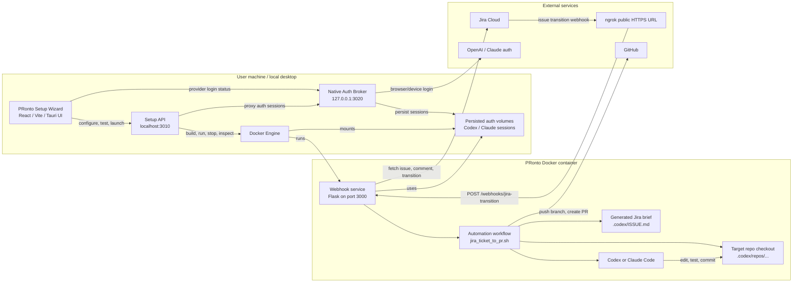
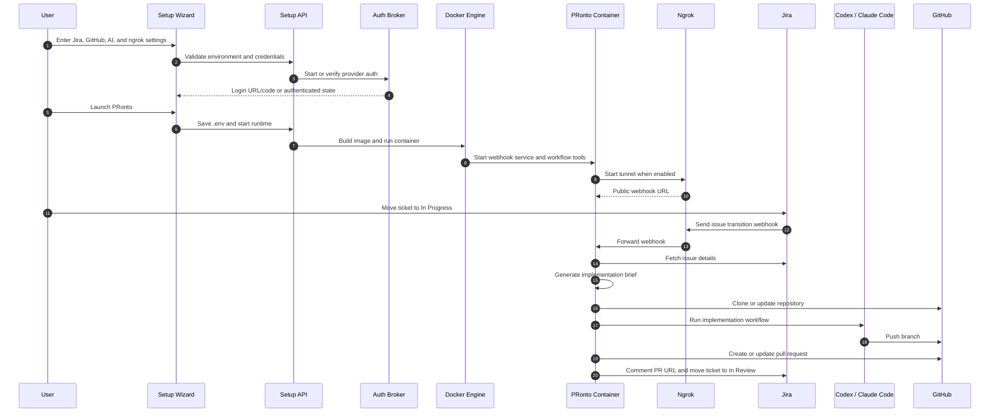

# PRonto

**PRonto turns a Jira ticket transition into a GitHub pull request.**

PRonto is a local-first automation app for engineering teams that want a clear,
repeatable handoff from Jira to an AI coding agent. Move a ticket into progress,
and PRonto can generate an implementation brief, prepare the target GitHub
repository, run Codex or Claude Code in Docker, push a branch, open a pull
request, and move the ticket to review.

The project is intentionally not a hosted SaaS product. You run the setup wizard
locally, keep credentials on your machine, and launch a Docker runtime that does
the automation work.

## What It Automates

PRonto connects the tools engineers already use:

- **Jira** remains the source of work and workflow state.
- **GitHub** remains the source of code, pull requests, and review.
- **Codex or Claude Code** becomes the implementation worker.
- **Docker** provides a repeatable runtime.
- **ngrok** can expose the local webhook endpoint to Jira Cloud.

When everything is configured, the happy path is:

1. A Jira issue moves from `READY_STATUS` to `IN_PROGRESS_STATUS`.
2. Jira sends PRonto a webhook.
3. PRonto fetches the issue and generates a Markdown implementation brief.
4. PRonto clones or refreshes the target GitHub repository.
5. PRonto creates a branch named `jira/<ISSUE_KEY>`.
6. Codex or Claude Code implements the ticket inside the repo.
7. PRonto commits, pushes, and opens or updates a pull request.
8. PRonto comments on Jira and moves the issue to `IN_REVIEW_STATUS`.

## Why This Is Useful

AI coding tools are powerful, but the operational handoff is often repetitive:
copy ticket context, find the right repository, create a branch, write the prompt,
run the agent, push changes, open a PR, and update Jira.

PRonto makes that handoff explicit, visible, and repeatable. The setup wizard is
not just a form; it explains each dependency, validates the environment, and gives
operators a launch console for health, logs, auth state, webhook delivery, and PR
URLs.

## Architecture


```mermaid
flowchart LR
  subgraph UserMachine["User machine / local desktop"]
    Browser["PRonto Setup Wizard<br/>React / Vite / Tauri UI"]
    SetupAPI["Setup API<br/>localhost:3010"]
    AuthBroker["Native Auth Broker<br/>127.0.0.1:3020"]
    Docker["Docker Engine"]
    AuthVolume["Persisted auth volumes<br/>Codex / Claude sessions"]
  end

  subgraph Container["PRonto Docker container"]
    Flask["Webhook service<br/>Flask on port 3000"]
    Workflow["Automation workflow<br/>jira_ticket_to_pr.sh"]
    Brief["Generated Jira brief<br/>.codex/ISSUE.md"]
    Repo["Target repo checkout<br/>.codex/repos/..."]
    Agent["Codex or Claude Code"]
  end

  subgraph Internet["External services"]
    Ngrok["ngrok public HTTPS URL"]
    Jira["Jira Cloud"]
    GitHub["GitHub"]
    ProviderAuth["OpenAI / Claude auth"]
  end

  Browser -->|"configure, test, launch"| SetupAPI
  Browser -->|"provider login status"| AuthBroker
  SetupAPI -->|"build, run, stop, inspect"| Docker
  SetupAPI -->|"proxy auth sessions"| AuthBroker
  AuthBroker -->|"browser/device login"| ProviderAuth
  AuthBroker -->|"persist sessions"| AuthVolume
  Docker -->|"runs"| Flask
  Docker -->|"mounts"| AuthVolume
  Flask -->|"uses"| AuthVolume

  Jira -->|"issue transition webhook"| Ngrok
  Ngrok -->|"POST /webhooks/jira-transition"| Flask
  Flask -->|"fetch issue, comment, transition"| Jira
  Flask --> Workflow
  Workflow --> Brief
  Workflow --> Repo
  Workflow --> Agent
  Agent -->|"edit, test, commit"| Repo
  Workflow -->|"push branch, create PR"| GitHub
```

## Runtime Flow


```mermaid
sequenceDiagram
  autonumber
  participant User
  participant Wizard as Setup Wizard
  participant SetupAPI as Setup API
  participant Broker as Auth Broker
  participant Docker as Docker Engine
  participant App as PRonto Container
  participant Ngrok
  participant Jira
  participant Agent as Codex / Claude Code
  participant GitHub

  User->>Wizard: Enter Jira, GitHub, AI, and ngrok settings
  Wizard->>SetupAPI: Validate environment and credentials
  SetupAPI->>Broker: Start or verify provider auth
  Broker-->>Wizard: Login URL/code or authenticated state
  User->>Wizard: Launch PRonto
  Wizard->>SetupAPI: Save .env and start runtime
  SetupAPI->>Docker: Build image and run container
  Docker->>App: Start webhook service and workflow tools
  App->>Ngrok: Start tunnel when enabled
  Ngrok-->>App: Public webhook URL
  User->>Jira: Move ticket to In Progress
  Jira->>Ngrok: Send issue transition webhook
  Ngrok->>App: Forward webhook
  App->>Jira: Fetch issue details
  App->>App: Generate implementation brief
  App->>GitHub: Clone or update repository
  App->>Agent: Run implementation workflow
  Agent->>GitHub: Push branch
  App->>GitHub: Create or update pull request
  App->>Jira: Comment PR URL and move ticket to In Review
```

## Quick Start

### Prerequisites

Install:

- Node.js and npm
- Docker Desktop or another working Docker Engine
- Python 3
- Git
- GitHub CLI (`gh`)
- Rust/Cargo only if you want to run the Tauri launcher

You also need:

- A Jira Cloud site and Jira API token.
- A GitHub token with repository contents and pull request access.
- Codex or Claude Code access.
- Optional: an ngrok account when Jira Cloud needs to reach your local machine.

### Start The Setup Wizard

Install dependencies:

```bash
npm install
```

Start all local development services:

```bash
npm run dev:all
```

This starts:

- `setup-api`
- the launcher-native auth broker host
- the frontend dev server

Open the Vite URL shown in the terminal, usually:

```text
http://localhost:5173
```

If you prefer to run each service manually, start the local setup API:

```bash
npm run dev:setup-api
```

Start the launcher-native auth broker host in a second terminal:

```bash
npm run dev:launcher-native-host
```

Start the frontend in a third terminal:

```bash
npm run dev:frontend
```

The setup wizard is the recommended entry point. It writes `.env`, validates the
major integrations, builds the Docker image, runs the container, and gives you a
launch console for health and logs.

## Guided Setup

The wizard walks through the system in the same order PRonto needs it:

1. **System Check**
   - Confirms Docker is reachable.
   - Builds the PRonto Docker image.
   - Offers Docker, Colima, and builder-cache recovery actions where available.

2. **Connect Jira**
   - Saves the Jira site URL, account email, API token, webhook secret, and
     workflow status names.
   - Validates that Jira credentials work before launch.

3. **Connect GitHub**
   - Saves and validates the token used for clone, branch push, and PR creation.
   - Configures the base branch, usually `main`.

4. **Choose AI Integration**
   - Selects `codex` or `claude`.
   - Starts the relevant login flow.
   - Persists auth state in Docker volumes so future runs do not need repeated
     browser login.

5. **Public Access**
   - Enables ngrok when Jira Cloud needs a public webhook URL.
   - Supports a reserved ngrok domain or an ephemeral tunnel URL.

6. **Jira Webhook**
   - Shows the webhook endpoint and setup guidance for Jira.
   - Helps confirm that webhook delivery reaches the local runtime.

7. **Ready For Launch**
   - Reviews configuration and highlights any blockers.

8. **Launch Console**
   - Starts the container.
   - Shows health, logs, auth status, webhook delivery, and PR links.

## Jira Webhook Setup

PRonto receives Jira transition events at:

```text
https://<your-public-url>/webhooks/jira-transition
```

Recommended Jira webhook configuration:

- **Event:** Issue updated
- **URL:** the PRonto public webhook URL
- **Secret:** the same value as `JIRA_WEBHOOK_SECRET`, if configured
- **JQL filter:**

```jql
status CHANGED FROM "To Do" TO "In Progress"
```

Adjust the status names to match `READY_STATUS` and `IN_PROGRESS_STATUS`.

The target Jira ticket should include a GitHub repository reference. The most
explicit format is:

```text
GitHub Repo: owner/repository
```

## Configuration

The wizard writes `.env` for you. For manual setup, start with:

```bash
cp .env.example .env
```

Important fields:

| Variable | Purpose |
|---|---|
| `JIRA_BASE_URL` | Jira Cloud site URL, for example `https://example.atlassian.net` |
| `JIRA_USER_EMAIL` | Jira account email used with the API token |
| `JIRA_API_TOKEN` | Jira API token |
| `JIRA_WEBHOOK_SECRET` | Optional shared secret for public webhooks |
| `READY_STATUS` | Status PRonto treats as ready for automation |
| `IN_PROGRESS_STATUS` | Status that triggers automation |
| `IN_REVIEW_STATUS` | Status used after PR creation |
| `GITHUB_TOKEN` | Token used for clone, push, and PR creation |
| `WORKFLOW_BASE_BRANCH` | Base branch for generated ticket branches |
| `AI_AGENT` | `codex` or `claude` |
| `NGROK_ENABLE` | Enables the ngrok tunnel when set to `true` |
| `NGROK_AUTHTOKEN` | ngrok auth token |
| `NGROK_DOMAIN` | Optional reserved ngrok domain |

Recommended fine-grained GitHub token permissions:

- `Contents: Read and write`
- `Pull requests: Read and write`
- `Metadata: Read`

## AI Authentication

PRonto supports Codex and Claude Code. The setup wizard is the safest way to
complete the login flow because it can start the auth broker, show the current
state, and persist sessions into Docker volumes.

Codex options:

- Device login through the setup wizard.
- Persisted login in the shared Docker auth volume.
- API key mode with `CODEX_API_KEY` or `OPENAI_API_KEY`.

Claude Code options:

- Browser/device login through the setup wizard.
- Persisted login in the shared Docker auth volume.

The automation runs inside Docker, so the AI agent must be authenticated inside
the runtime environment, not only on the host shell.

## Direct Docker Run

The wizard can build and run the container for you. The equivalent manual flow is:

```bash
docker build -t jira-workflow-automation .
docker rm -f jira-automation 2>/dev/null || true
docker run --env-file .env -p 3000:3000 \
  -v codex-state:/data/codex \
  -v claude-state:/data/claude \
  --name jira-automation -d jira-workflow-automation
```

Check runtime health and logs:

```bash
curl -sS http://localhost:3000/health
docker logs -f jira-automation
```

## Explainability And Debugging

PRonto is designed to make the automation inspectable:

- The generated Jira brief is written to `.codex/<ISSUE_KEY>.md`.
- Target repositories are cloned under `.codex/repos/<owner-repository>/`.
- The launch console streams container logs and health state.
- PR URLs are detected from workflow output and surfaced in the UI.
- Jira webhook delivery can be tested from the wizard.
- Docker diagnostics are exposed before the container is launched.
- Auth state for Codex and Claude is persisted in named Docker volumes.

If automation fails, inspect these in order:

1. The launch console logs.
2. The generated `.codex/<ISSUE_KEY>.md` brief.
3. The target repo checkout under `.codex/repos/`.
4. `docker logs jira-automation`.
5. Jira webhook delivery history.
6. GitHub token permissions and branch protection rules.

## Development Commands

Install and run the local development stack:

```bash
npm install
npm run dev:all
```

`npm run dev:all` runs `scripts/dev-start-all.sh`, which starts the setup API,
launcher-native auth broker host, and frontend together. Press `Ctrl+C` in that
terminal to stop all three.

Useful checks:

```bash
npm run check
npm run build:frontend
npm run typecheck:frontend
npm run test:setup-api
npm run test:auth-broker
npm run test:python
```

Launcher development:

```bash
npm run build:frontend
npm run dev:launcher-native-host
```

## Repository Map

```text
frontend/            React setup wizard and launch console
setup-api/           Local setup API, Docker control, readiness checks
auth-broker/         Development auth broker HTTP service
launcher/            Tauri launcher and native auth host
src/                 Flask webhook service and Jira orchestration
tools/jira/          Jira issue to Markdown implementation brief
jira_ticket_to_pr.sh Main automation workflow script
docker/              Container startup and runtime helpers
tests/               Python automation tests
```

Start reading here:

- `frontend/src/features/setup-wizard/SetupWizardApp.tsx` for the setup wizard.
- `setup-api/src/server.js` for the local control API.
- `src/app.py` for the Jira webhook contract.
- `jira_ticket_to_pr.sh` for repository prep, AI execution, and PR creation.
- `tools/jira/jira_to_spec.py` for the generated implementation brief.

## State And Persistence

PRonto intentionally avoids a database. State is stored where operators can see
it:

- `.env` for runtime configuration.
- `.codex/<ISSUE_KEY>.md` for generated implementation briefs.
- `.codex/repos/` for target repository checkouts.
- Docker volumes for Codex and Claude auth state.
- Container logs for runtime history and troubleshooting.

## Security Notes

PRonto is designed for local use by a trusted operator.

- Keep Jira, GitHub, ngrok, Codex, and Claude credentials out of source control.
- Use `JIRA_WEBHOOK_SECRET` when exposing the webhook publicly.
- Treat ngrok as a public route to your local container.
- Use least-privilege GitHub tokens.
- Remember that the selected AI coding tool receives write access to the target
  repository checkout.

## Current Boundaries

- Workflow history is log-based rather than stored in a database.
- Webhook processing uses local background execution, not a durable queue.
- Live end-to-end behavior depends on Jira, GitHub, ngrok, Codex, or Claude.
- The setup experience is local-first and developer-oriented.

PRonto is a working end-to-end automation system: Jira transition in, GitHub pull
request out. The current focus is making setup, diagnostics, and explainability
strong enough that another engineer can understand and operate the system with
confidence.
