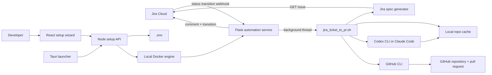
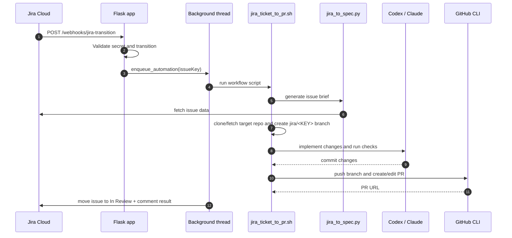
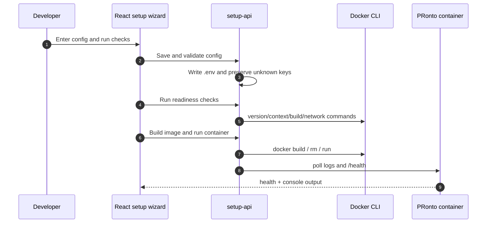
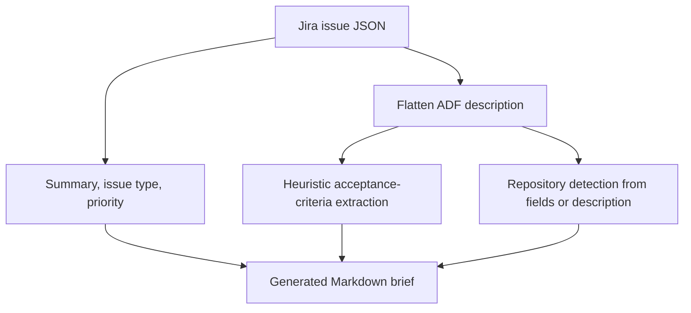
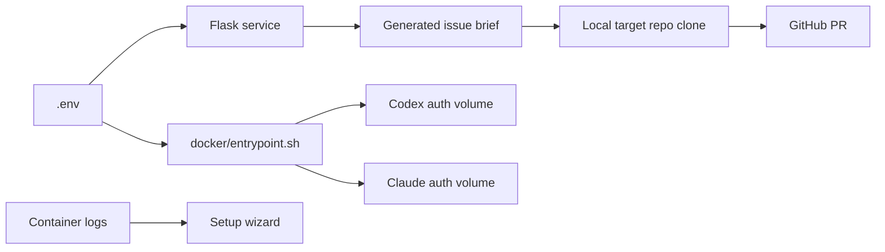
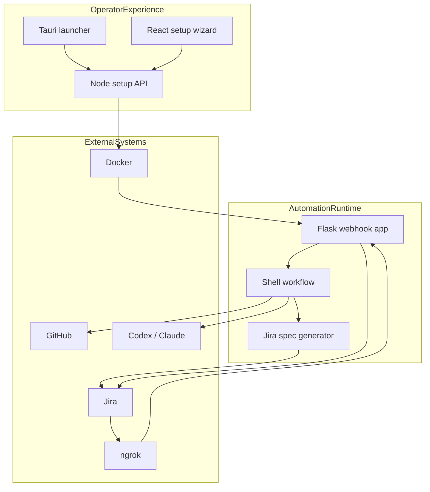
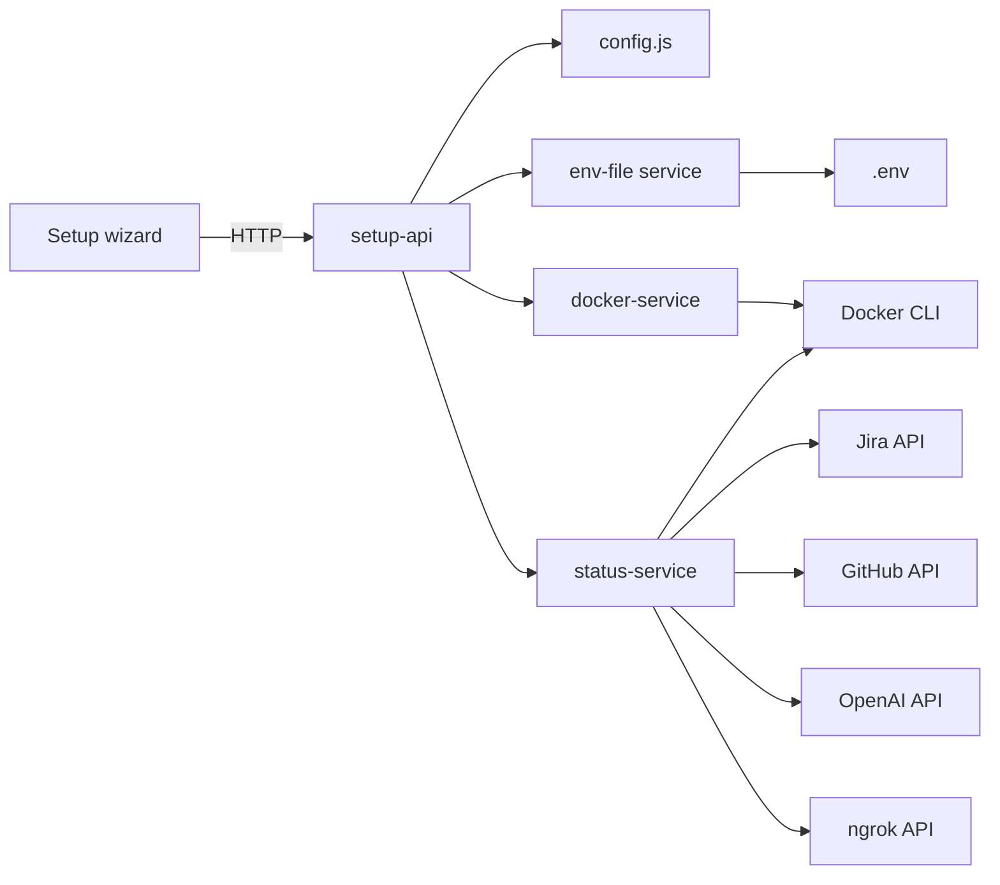

# PRonto

Jira-driven engineering workflow automation with a guided local setup experience.

## Overview

PRonto watches for a specific Jira workflow transition, turns the Jira ticket into an implementation brief, invokes an AI coding CLI inside a Docker container, pushes the resulting branch to GitHub, opens or updates a pull request, and reports the outcome back to Jira.

Today the repository contains three layers:

- A Python automation service that receives Jira webhooks and orchestrates the workflow.
- A Node-based setup API plus React setup wizard that helps a user configure `.env`, validate external integrations, build the Docker image, and launch the container.
- A small Tauri launcher that starts the setup flow as a desktop-friendly entrypoint.

The repo is best understood as a local-first developer tool rather than a multi-tenant SaaS service. The core workflow is real and implemented; the surrounding setup experience is actively being built out to make onboarding less manual.

## What It Does

### Implemented

- Receives Jira transition webhooks at `POST /webhooks/jira-transition`.
- Filters webhooks so automation only runs on `READY_STATUS -> IN_PROGRESS_STATUS`.
- Validates an optional shared webhook secret.
- Generates a Markdown implementation brief from the Jira issue using Jira REST APIs.
- Detects the target GitHub repository from Jira fields or description text.
- Clones or reuses a local checkout of that target repository under `.codex/repos/`.
- Creates a working branch named `jira/<ISSUE_KEY>` from the configured base branch.
- Invokes either `codex` or `claude` CLI to implement the ticket in the target repository.
- Pushes the branch, creates or updates a PR with `gh`, and extracts the PR URL.
- Transitions the Jira issue to `IN_REVIEW_STATUS` when a PR is created.
- Posts success or failure comments back to Jira.
- Provides a setup UI that can validate Jira, GitHub, OpenAI/Codex, ngrok, Docker, and container health.
- Provides Docker diagnostics including context selection, Colima helpers, network checks, builder-cache reset, image build, container run, health polling, and log viewing.
- Provides a Tauri launcher that finds the workspace, starts the setup API, and opens the setup flow in a browser.

### Partially Implemented

- The setup experience is broad and useful, but still depends on local conventions like Docker, Node, built frontend assets, and CLI tools already being available.
- Claude support exists in the automation path, but most user-facing naming and readiness surfaces are still centered on Codex.
- The setup API serves the built frontend directly in packaged mode, but the frontend and backend are still coupled by convention rather than a formal API versioning strategy.
- Architecture documentation existed before this rewrite, but some older docs and examples no longer match the current defaults exactly.

### Planned Or Implied

- A more polished packaged distribution story where non-technical users do not need to know about Docker, Node, or built frontend artifacts.
- Stronger persistence and historical run tracking beyond container logs.
- More robust queueing and concurrency controls for webhook-triggered jobs.
- Broader end-to-end integration coverage against live Jira, GitHub, AI, and ngrok environments.

## Architecture

At runtime, PRonto is a webhook-driven orchestrator. The Flask app is intentionally thin: it validates the webhook, starts a background thread, and delegates the actual repo manipulation to a shell workflow. The shell workflow is where repository checkout, AI invocation, git push, and PR creation happen. Around that, the setup UI helps users produce a valid `.env`, diagnose local Docker problems, and launch the container safely.


```mermaid
flowchart LR
    Jira[Jira Cloud] -->|status transition webhook| Webhook[Flask automation service]
    Webhook -->|background thread| Workflow[jira_ticket_to_pr.sh]
    Workflow --> Spec[Jira spec generator]
    Spec -->|GET issue| Jira
    Workflow --> RepoCache[Local repo cache]
    Workflow --> AI[Codex CLI or Claude Code]
    Workflow --> GH[GitHub CLI]
    AI --> RepoCache
    GH --> GitHub[GitHub repository + pull request]
    Webhook -->|comment + transition| Jira

    User[Developer] --> SetupUI[React setup wizard]
    SetupUI --> SetupAPI[Node setup API]
    SetupAPI --> Env[.env]
    SetupAPI --> Docker[Local Docker engine]
    Docker --> Webhook
    Launcher[Tauri launcher] --> SetupAPI
```

Architectural boundaries:

- `src/` owns webhook handling and Jira-side orchestration.
- `jira_ticket_to_pr.sh` owns repo preparation, AI execution, and PR creation.
- `tools/jira/` owns Jira-to-spec translation.
- `setup-api/` owns local machine checks, `.env` management, Docker control, and status aggregation.
- `frontend/` owns the guided onboarding and launch console UX.
- `launcher/` owns the desktop wrapper around the setup experience.

## Core Flows

### 1. Jira Transition To Pull Request


```mermaid
sequenceDiagram
    autonumber
    participant Jira as Jira Cloud
    participant App as Flask app
    participant Worker as Background thread
    participant Script as jira_ticket_to_pr.sh
    participant Spec as jira_to_spec.py
    participant AI as Codex / Claude
    participant GH as GitHub CLI

    Jira->>App: POST /webhooks/jira-transition
    App->>App: Validate secret and transition
    App->>Worker: enqueue_automation(issueKey)
    Worker->>Script: run workflow script
    Script->>Spec: generate issue brief
    Spec->>Jira: fetch issue data
    Script->>Script: clone/fetch target repo and create jira/<KEY> branch
    Script->>AI: implement changes and run checks
    AI-->>Script: commit changes
    Script->>GH: push branch and create/edit PR
    GH-->>Script: PR URL
    Worker->>Jira: move issue to In Review + comment result
```

Important characteristics:

- The webhook request returns quickly with `202 Accepted`; work continues on a daemon thread.
- The workflow is synchronous after kickoff. There is no external queue, job table, or retry subsystem.
- Success is inferred primarily from process exit code and whether a PR URL appears in workflow output.

### 2. Setup And Launch Flow


```mermaid
sequenceDiagram
    autonumber
    participant User as Developer
    participant UI as React setup wizard
    participant API as setup-api
    participant Docker as Docker CLI
    participant Container as PRonto container

    User->>UI: Enter config and run checks
    UI->>API: Save and validate config
    API->>API: Write .env and preserve unknown keys
    UI->>API: Run readiness checks
    API->>Docker: version/context/build/network commands
    UI->>API: Build image and run container
    API->>Docker: docker build / rm / run
    API->>Container: poll logs and /health
    Container-->>UI: health + console output
```

### 3. Jira Spec Generation


```mermaid
flowchart TD
    Issue[Jira issue JSON] --> Desc[Flatten ADF description]
    Issue --> Meta[Summary, issue type, priority]
    Desc --> AC[Heuristic acceptance-criteria extraction]
    Desc --> Repo[Repository detection from fields or description]
    Meta --> Brief[Generated Markdown brief]
    AC --> Brief
    Repo --> Brief
```

The generated brief is the contract between Jira and the AI tool. It is intentionally lightweight and stored under `.codex/<ISSUE_KEY>.md`, then copied into the target repository before the AI CLI runs.

## Repository Structure

The repo contains one automation product and two operator-facing shells around it.

```text
src/                 Flask webhook service and Jira-side orchestration
tools/jira/          Jira issue -> Markdown implementation brief conversion
docker/              Container entrypoint and runtime bootstrap logic
setup-api/           Local setup/control plane for env, Docker, readiness, logs
frontend/            React onboarding and launch console
launcher/            Tauri desktop wrapper for the setup flow
tests/               Python unit tests for webhook app and Jira spec generation
docs/                Legacy architecture notes
scripts/             Ad hoc integration helpers
```

How to read it efficiently:

1. Start with [`src/app.py`](/Users/ryankenny/Projects/JiraWorkflowAutomation/src/app.py:1) for the webhook contract and orchestration lifecycle.
2. Move to [`jira_ticket_to_pr.sh`](/Users/ryankenny/Projects/JiraWorkflowAutomation/jira_ticket_to_pr.sh:1) for the real automation workflow.
3. Read [`tools/jira/jira_to_spec.py`](/Users/ryankenny/Projects/JiraWorkflowAutomation/tools/jira/jira_to_spec.py:1) to understand what the AI tool actually receives.
4. Read [`setup-api/src/server.js`](/Users/ryankenny/Projects/JiraWorkflowAutomation/setup-api/src/server.js:1) and the services under `setup-api/src/services/` for local setup, launch, and diagnostics.
5. Read [`frontend/src/features/setup-wizard/SetupWizardApp.tsx`](/Users/ryankenny/Projects/JiraWorkflowAutomation/frontend/src/features/setup-wizard/SetupWizardApp.tsx:1) for the operator experience.
6. Read [`launcher/src-tauri/src/main.rs`](/Users/ryankenny/Projects/JiraWorkflowAutomation/launcher/src-tauri/src/main.rs:1) only if you care about the packaged launcher flow.

## Key Modules

### Automation Service

- [`src/app.py`](/Users/ryankenny/Projects/JiraWorkflowAutomation/src/app.py:1)
  - Loads environment, validates required Jira credentials at import time, and exposes the Flask app.
  - Implements `/health`.
  - Implements `/webhooks/jira-transition`.
  - Starts background automation threads with `enqueue_automation`.
  - Posts Jira comments and performs Jira status transitions.
  - Streams workflow stdout, keeps high-signal lines, and turns them into human-readable logs.

### Workflow Script

- [`jira_ticket_to_pr.sh`](/Users/ryankenny/Projects/JiraWorkflowAutomation/jira_ticket_to_pr.sh:1)
  - Generates the Jira brief.
  - Resolves the target repo from explicit input or the brief.
  - Clones or refreshes the repo under `.codex/repos/`.
  - Creates the branch and dispatches to either `codex` or `claude`.
  - Pushes with a retry path using `--force-with-lease`.
  - Creates or updates the PR body from the generated brief plus automation metadata.

### Jira Spec Generator

- [`tools/jira/jira_to_spec.py`](/Users/ryankenny/Projects/JiraWorkflowAutomation/tools/jira/jira_to_spec.py:1)
  - Fetches the Jira issue via REST.
  - Flattens Atlassian Document Format into readable Markdown-ish text.
  - Heuristically extracts acceptance criteria.
  - Detects the target repository from fields, description conventions, or GitHub URLs.

### Setup API

- [`setup-api/src/server.js`](/Users/ryankenny/Projects/JiraWorkflowAutomation/setup-api/src/server.js:1)
  - Hosts a lightweight HTTP API and also serves the built frontend.
  - Exposes endpoints for config validation, `.env` save/read, readiness checks, Docker build/run/stop, logs, and health.

- [`setup-api/src/config.js`](/Users/ryankenny/Projects/JiraWorkflowAutomation/setup-api/src/config.js:1)
  - Defines supported config fields and defaults.
  - Validates auth modes, required fields, and safe CLI arg input.
  - Serializes `.env` content.

- [`setup-api/src/services/docker-service.js`](/Users/ryankenny/Projects/JiraWorkflowAutomation/setup-api/src/services/docker-service.js:1)
  - Encapsulates all Docker and Colima interactions.
  - Contains the project’s richest operational diagnostics.

- [`setup-api/src/services/status-service.js`](/Users/ryankenny/Projects/JiraWorkflowAutomation/setup-api/src/services/status-service.js:1)
  - Performs external API checks against Jira, GitHub, OpenAI, and ngrok.
  - Aggregates container health, logs, and PR discovery for the frontend.

### Frontend Setup Wizard

- [`frontend/src/features/setup-wizard/SetupWizardApp.tsx`](/Users/ryankenny/Projects/JiraWorkflowAutomation/frontend/src/features/setup-wizard/SetupWizardApp.tsx:1)
  - Implements the full onboarding flow: welcome, system check, Jira, GitHub, AI integration, ngrok, webhook, review, and launch console.
  - Maintains config state and drives readiness checks against the setup API.
  - Shows container logs, health, observed PR URLs, and device-login cues.

### Launcher

- [`launcher/src-tauri/src/main.rs`](/Users/ryankenny/Projects/JiraWorkflowAutomation/launcher/src-tauri/src/main.rs:1)
  - Finds the PRonto workspace.
  - Verifies Node and `frontend/dist` are present.
  - Starts the setup API if needed and opens `http://127.0.0.1:3010`.

## Data and State Model

The project is mostly file- and process-driven. There is no application database.

Primary state surfaces:

- `.env`
  - Source of truth for runtime configuration.
  - Managed manually or through the setup UI.
  - The setup API preserves unknown keys when rewriting the file.

- `.codex/<ISSUE_KEY>.md`
  - Generated issue brief that captures Jira context, acceptance criteria, target repository, and implementation instructions.

- `.codex/repos/<owner-repo>/`
  - Local clone cache for target repositories used by the automation workflow.

- Docker volumes
  - `/data/codex` and `/data/claude` persist AI CLI login/session state across container restarts.

- Container logs
  - Act as the main execution history and debugging source.
  - The setup UI mines logs for PR URLs and ngrok URLs.


```mermaid
flowchart LR
    Env[.env] --> Flask[Flask service]
    Env --> Entry[docker/entrypoint.sh]
    Flask --> Brief[Generated issue brief]
    Brief --> Repo[Local target repo clone]
    Repo --> PR[GitHub PR]
    Entry --> CodexState[Codex auth volume]
    Entry --> ClaudeState[Claude auth volume]
    DockerLogs[Container logs] --> SetupUI[Setup wizard]
```

A few important implications:

- Configuration changes are coarse-grained and restart-oriented.
- Workflow history is not normalized into structured records.
- The brief is a first-class artifact and a good debugging anchor when automation behavior looks wrong.

## Running the Project

### Option 1: Use The Setup Wizard

From the repo root:

```bash
npm install
npm run dev:setup-api
npm run dev:auth-broker
```

In a second terminal:

```bash
npm run dev:frontend
```

Open the Vite URL, usually `http://localhost:5173`.

This is the best path if you want guided config editing, Docker diagnostics, readiness checks, and a launch console.

Auth broker transport configuration:

- `AUTH_BROKER_TRANSPORT`
  - `launcher_http` (default): setup-api targets a launcher-managed broker endpoint.
  - `standalone_http`: setup-api targets a standalone broker process (useful in local development).
- `AUTH_BROKER_BASE_URL`
  - Broker base URL, default `http://127.0.0.1:3020`.
- `AUTH_BROKER_DEV_EMULATION`
  - Default `false`.
  - When `true`, setup-api may emulate launcher hosting by spawning the local Node auth-broker process if unreachable.
- `AUTH_BROKER_AUTOSTART`
  - Default `true`.
  - Only applies when `AUTH_BROKER_DEV_EMULATION=true`.
- `AUTH_BROKER_DEV_EMULATION_HOST`
  - Default `native`.
  - `native`: setup-api dev emulation starts the Rust launcher host in `launcher/src-tauri`.
  - `node`: setup-api dev emulation starts the legacy Node broker.

Production posture:

- End users should not manage a Node runtime for provider authentication.
- In production launcher mode, interactive auth hosting is expected to be launcher-managed, and setup-api should proxy only.

### Option 2: Run The Automation Service Directly In Docker

Create `.env` from the example and fill in Jira, GitHub, and AI credentials:

```bash
cp .env.example .env
docker build -t jira-workflow-automation .
docker rm -f jira-automation 2>/dev/null || true
docker run --env-file .env -p 3000:3000 \
  -v codex-state:/data/codex \
  -v claude-state:/data/claude \
  --name jira-automation -d jira-workflow-automation
```

Set these required values in `.env`:

- `JIRA_BASE_URL=https://<your-site>.atlassian.net`
- `JIRA_USER_EMAIL=<jira-email>`
- `JIRA_API_TOKEN=<jira-api-token>`
- `READY_STATUS="To Do"`
- `IN_PROGRESS_STATUS="In Progress"`
- `IN_REVIEW_STATUS="In Review"`
- `GITHUB_TOKEN=<github-pat>` (recommended; `GH_TOKEN` also supported)
- `REQUIRE_GITHUB_AUTH=true`
- `CODEX_EXEC_ARGS=--dangerously-bypass-approvals-and-sandbox`

External key setup:

- Jira API token:
  - Create at Atlassian account security: `https://id.atlassian.com/manage-profile/security/api-tokens`
  - Put Jira site URL/email/token into:
    - `JIRA_BASE_URL`
    - `JIRA_USER_EMAIL`
    - `JIRA_API_TOKEN`
- GitHub token (for push + PR):
  - Create PAT at GitHub settings: `https://github.com/settings/tokens`
  - Recommended fine-grained token permissions:
    - Repository `Contents: Read and write`
    - Repository `Pull requests: Read and write`
    - Repository `Metadata: Read`
  - Set in `.env`: `GITHUB_TOKEN=<token>` (or `GH_TOKEN`)
- OpenAI/Codex access:
  - API key mode: set `CODEX_API_KEY` (or `OPENAI_API_KEY`) and `CODEX_BOOTSTRAP_LOGIN=true`
  - Device login mode: keep API key empty and use persisted login (see below)

Codex auth options (pick one):

- API key mode:
  - `CODEX_BOOTSTRAP_LOGIN=true`
  - `CODEX_API_KEY=<openai-api-key>` (or `OPENAI_API_KEY`)
- Persistent interactive login mode:
  - `CODEX_BOOTSTRAP_LOGIN=false`
  - Run one-time: `docker exec -it jira-automation codex login`
  - State persists in `-v codex-state:/data/codex`

Optional but recommended:

- `JIRA_WEBHOOK_SECRET=<shared-secret>` (leave empty unless Jira webhook secret is configured)
- `NGROK_ENABLE=true`
- `NGROK_AUTHTOKEN=<ngrok-authtoken>`
- `NGROK_DOMAIN=<reserved-domain.ngrok-free.dev>`
- `NGROK_API_KEY=<ngrok-api-key>` (used to auto-provision/check reserved domain)

## 2) Build and run

```bash
curl -sS http://localhost:3000/health
docker logs -f jira-automation
```

### Option 3: Use The Launcher

The launcher expects `frontend/dist` to already exist:

```bash
npm install
npm run build:frontend
npm run dev:launcher
```

For a packaged build:

```bash
npm run build:frontend
npm run build:launcher
```

## Development Workflow

Where to start depends on what you are changing:

- Webhook behavior: start in `src/app.py`.
- AI workflow behavior: start in `jira_ticket_to_pr.sh`.
- Jira brief quality: start in `tools/jira/jira_to_spec.py`.
- Local setup and launch behavior: start in `setup-api/`.
- Onboarding UX: start in `frontend/`.
- Packaged desktop launch: start in `launcher/`.

Practical workflow:

1. Update `.env` or use the setup wizard to generate it.
2. Run unit tests for the part you touched.
3. If you changed container/runtime behavior, rebuild and relaunch the Docker image.
4. Use the setup wizard or `docker logs` to inspect live behavior.
5. Treat the generated issue brief and container logs as the fastest debugging artifacts.

Subsystem boundary rules of thumb:

- Keep Jira API semantics out of the frontend.
- Keep Docker/OS-level concerns in `setup-api`, not in the Flask app.
- Keep AI prompting and git orchestration inside the workflow script unless there is a strong reason to move them.
- Keep the Flask layer thin and stateless.

## Testing

There are two main unit-test suites today.

- Python `unittest` tests under `tests/`
  - Cover webhook transition filtering, Jira comment/transition behavior, workflow error handling, timeout handling, and Jira spec parsing.

- Node `node:test` tests under `setup-api/test/`
  - Cover config validation, `.env` serialization and preservation, HTTP routing, Docker diagnostics, Docker run/build commands, and status-service behavior.

Run them with:

```bash
python -m unittest discover -s tests
npm run test:setup-api
```

Confidence level:

- Good confidence on pure logic in the Flask app, Jira spec generation, and setup-api services.
- Moderate confidence on the shape of Docker command orchestration.
- Lower confidence on full end-to-end behavior across Jira, GitHub, ngrok, Docker, and AI CLIs because those are mostly mocked in tests.

Biggest testing gaps:

- No end-to-end test that exercises a real webhook through to PR creation.
- No frontend component or browser tests.
- No launcher tests.
- No structured regression suite around the shell workflow script itself.

## Observability / Debugging

PRonto is primarily observable through logs and readiness checks.

- Flask logs:
  - Webhook receipt, skip reasons, workflow lifecycle, and filtered high-signal subprocess output.

- Setup wizard launch console:
  - Shows recent container logs, container health, and discovered PR URLs.

- Setup API readiness endpoints:
  - Validate Jira, GitHub, OpenAI/Codex, ngrok, Docker, and local health independently.

- Container state:
  - `docker logs`, `docker ps`, and `curl http://localhost:3000/health` are the core operational loop.

- Generated brief:
  - `.codex/<ISSUE_KEY>.md` is often the fastest place to verify whether Jira context was interpreted correctly.

## Current Limitations

- Automation jobs run in daemon threads inside the Flask process. There is no durable queue, retry engine, or run history store.
- The workflow relies heavily on shelling out to external CLIs: `git`, `gh`, `codex`, `claude`, `ngrok`, and `docker`.
- The setup wizard is useful, but it is still effectively an operator console over local machine state rather than a sealed installer.
- The main runtime has no persistence beyond volumes, clone cache, `.env`, and logs.
- Error handling is strongest around configuration and local diagnostics; it is weaker around distributed recovery after partial workflow success.
- Older docs and `.env.example` defaults do not always line up perfectly with the latest Docker-safe recommendations.

## Suggested Next Steps

1. Add a durable run model with job IDs, status tracking, timestamps, and structured logs.
2. Move workflow execution behind a proper queue/worker boundary instead of daemon threads in Flask.
3. Add end-to-end integration coverage for a happy-path Jira -> PR workflow.
4. Add browser-level tests for the setup wizard and smoke tests for the launcher.
5. Normalize configuration docs and examples so `.env.example`, setup defaults, Docker defaults, and README guidance always match.

## Appendix: Visual Diagrams

### Subsystem Boundary View


```mermaid
flowchart TB
    subgraph OperatorExperience
        Launcher[Tauri launcher]
        UI[React setup wizard]
        API[Node setup API]
    end

    subgraph AutomationRuntime
        Flask[Flask webhook app]
        Script[Shell workflow]
        Spec[Jira spec generator]
    end

    subgraph ExternalSystems
        Jira[Jira]
        GitHub[GitHub]
        AI[Codex / Claude]
        Ngrok[ngrok]
        Docker[Docker]
    end

    Launcher --> API
    UI --> API
    API --> Docker
    Docker --> Flask
    Jira --> Ngrok
    Ngrok --> Flask
    Flask --> Script
    Script --> Spec
    Spec --> Jira
    Script --> AI
    Script --> GitHub
    Flask --> Jira
```

### Local Setup Control Plane


```mermaid
flowchart LR
    UI[Setup wizard] -->|HTTP| API[setup-api]
    API --> Config[config.js]
    API --> EnvSvc[env-file service]
    API --> DockerSvc[docker-service]
    API --> StatusSvc[status-service]
    EnvSvc --> Env[.env]
    DockerSvc --> Docker[Docker CLI]
    StatusSvc --> Jira[Jira API]
    StatusSvc --> GitHub[GitHub API]
    StatusSvc --> OpenAI[OpenAI API]
    StatusSvc --> Ngrok[ngrok API]
    StatusSvc --> Docker
```

For deeper implementation detail, see [ARCHITECTURE.md](ARCHITECTURE.md). For the shortest practical setup path, see [QUICKSTART.md](QUICKSTART.md).
