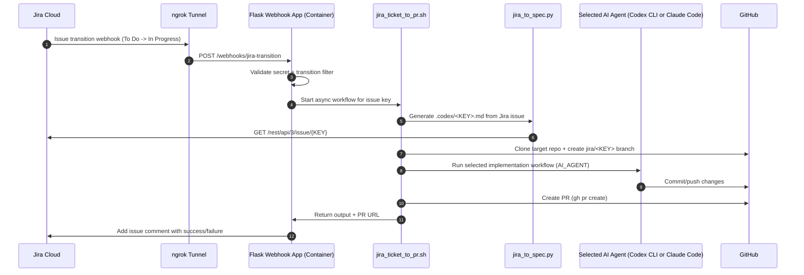

# Workflow and Architecture

## End-to-End Workflow



## Container Architecture

```mermaid
flowchart LR
    subgraph JiraCloud[Jira Cloud]
        JWebhook[Webhook Configuration]
        JIssue[Jira Issue Data]
    end

    subgraph PublicIngress[Public Ingress]
        NG[ngrok Reserved/Ephemeral Domain]
    end

    subgraph Container[Docker Container: jira-workflow-automation]
        Flask[Flask app.py\n/webhooks/jira-transition]
        EP[docker/entrypoint.sh]
        WF[jira_ticket_to_pr.sh]
        SpecPy[tools/jira/jira_to_spec.py]
        CodexCLI[Codex CLI]
        ClaudeCLI[Claude Code CLI]
        GHCLI[GitHub CLI]
        AgentSwitch{AI_AGENT}
    end

    subgraph Persistent[Persistent Storage]
        Vol[/Docker volume: /data/codex\n(Codex login/session state)/]
        VolClaude[/Docker volume: /data/claude\n(Claude login/session state)/]
    end

    subgraph GitHubCloud[GitHub]
        Repo[Target Repository]
        PR[Pull Request]
    end

    JWebhook --> NG --> Flask
    Flask --> WF
    WF --> SpecPy --> JIssue
    WF --> AgentSwitch
    AgentSwitch --> CodexCLI
    AgentSwitch --> ClaudeCLI
    WF --> GHCLI
    CodexCLI --> Repo
    ClaudeCLI --> Repo
    GHCLI --> PR
    EP --> CodexCLI
    EP --> ClaudeCLI
    EP --> GHCLI
    EP --> NG
    CodexCLI <--> Vol
    ClaudeCLI <--> VolClaude
```
